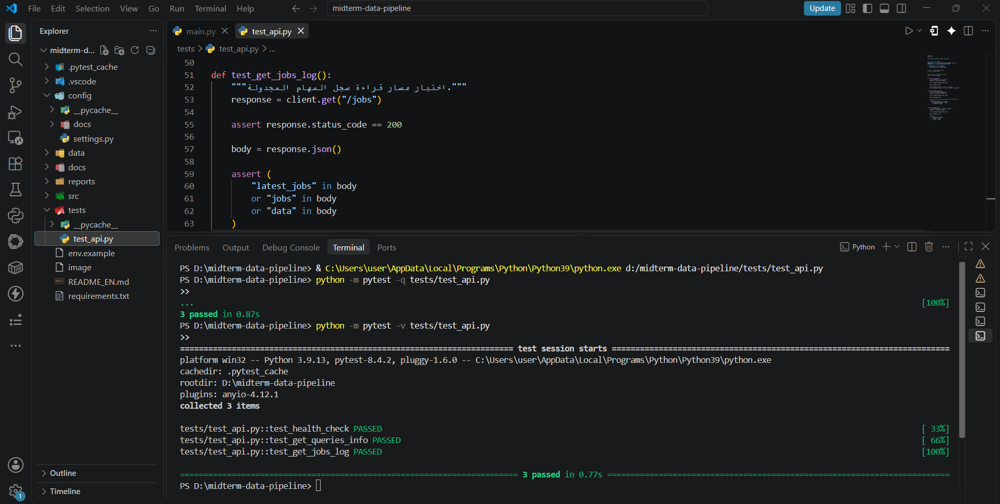
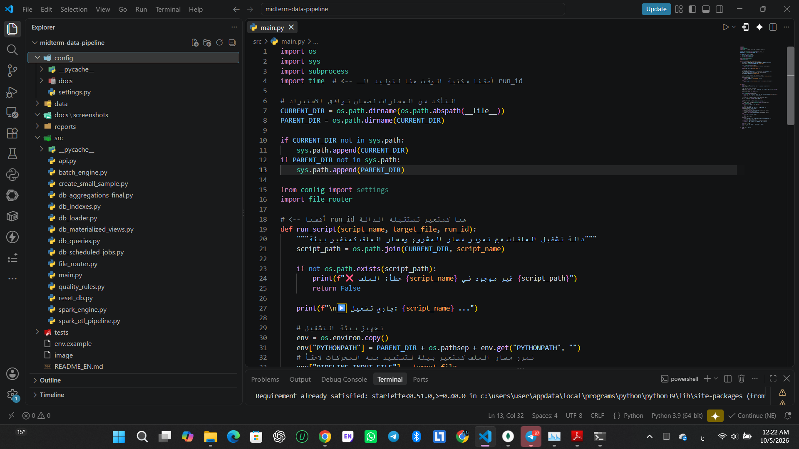
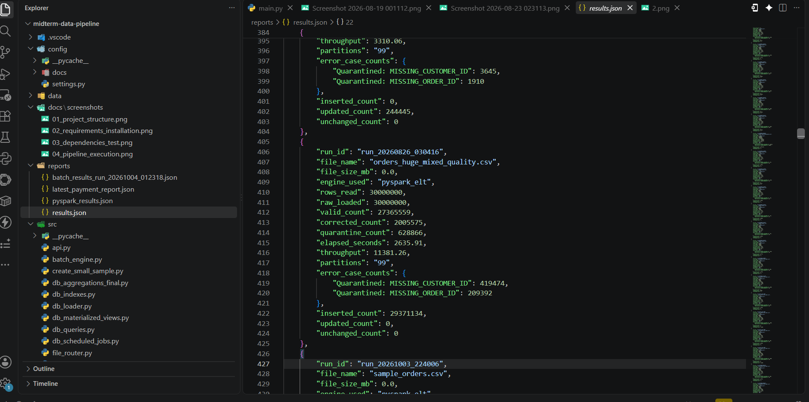
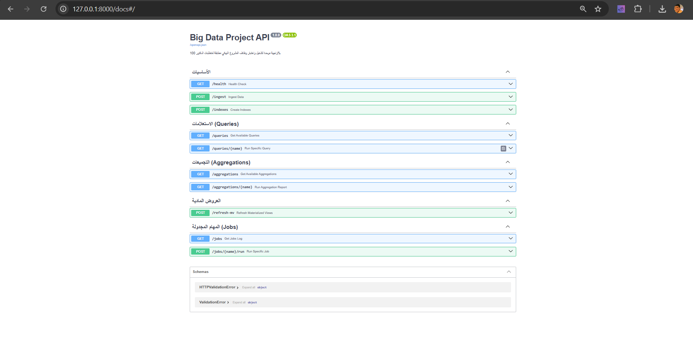
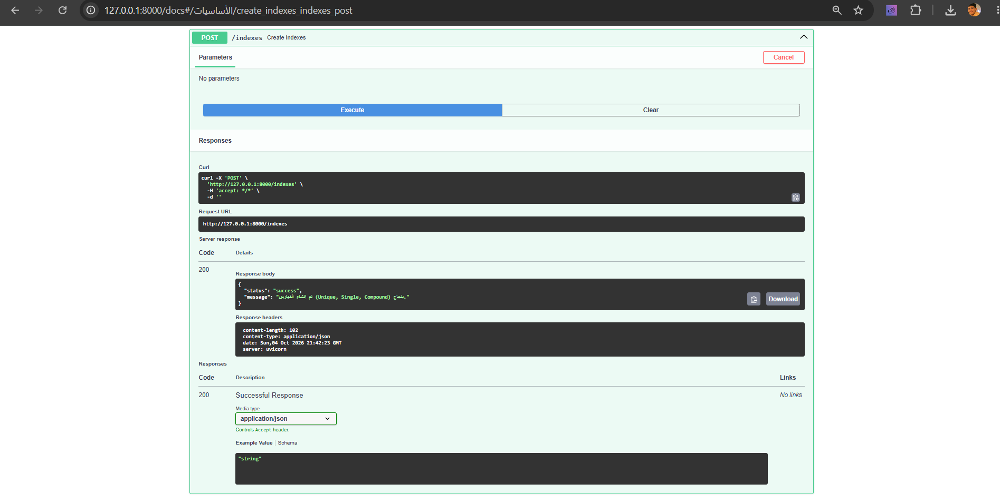
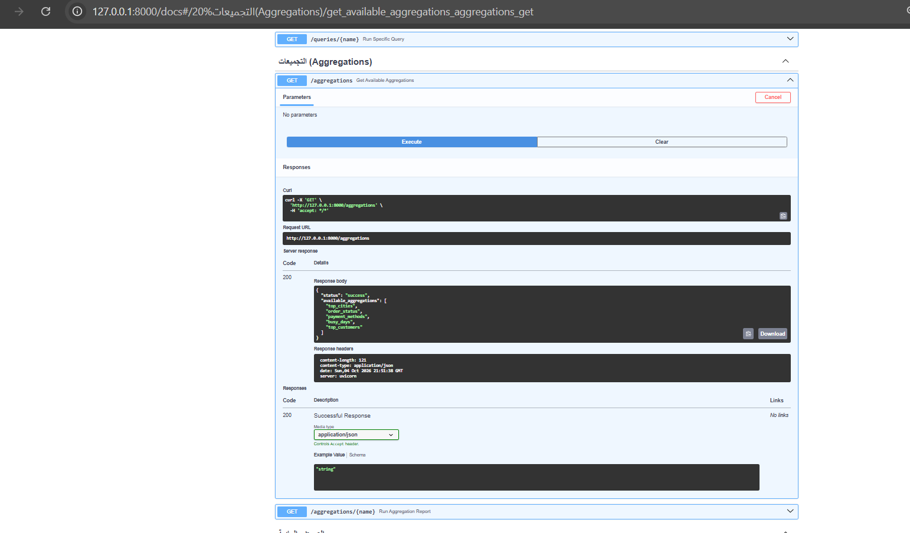
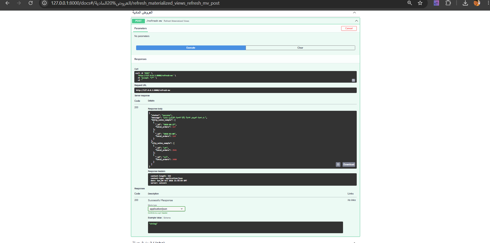
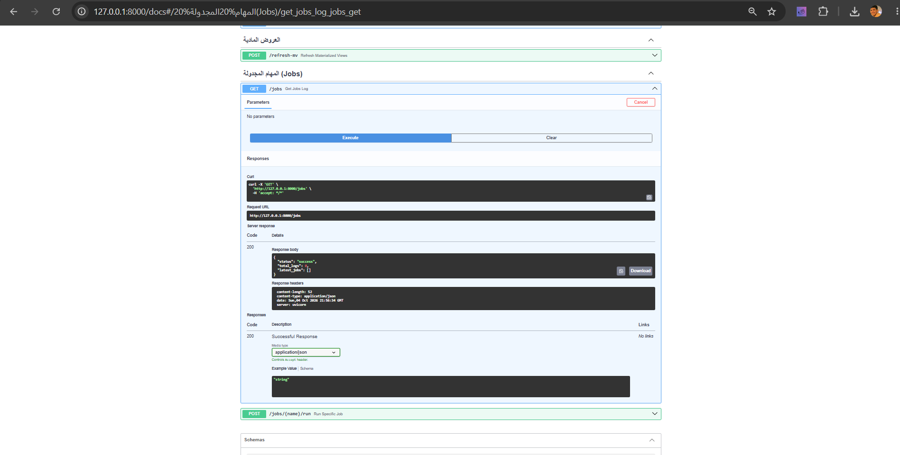

# Hybrid Data Pipeline & Analytics
## Big Data Course Project — # Hybrid Data Pipeline for Order Data Processing


> **Course:** Big Data — Practical Project  
> **Project type:** Data Engineering, ELT, Analytics, and API  
> **Database:** MongoDB  
> **Language:** Python  
> **Processing engines:** Python Batch and Apache PySpark  
> **API:** FastAPI with Swagger UI

---

## 1. Project Overview

This project is an end-to-end data processing and analytics system for order data. It accepts clean and corrupted records, routes the input to the appropriate processing engine, applies data-quality rules, stores the results in MongoDB, and exposes analytical functions through a unified REST API.

The project is implemented in two connected phases within the same repository:

### Midterm Phase — Data Engineering and ELT

- Read CSV input files.
- Automatically select the appropriate processing engine.
- Use Python Batch for small files.
- Use PySpark for large files.
- Load raw data into MongoDB.
- Clean, validate, and standardize records.
- Correct errors that can be fixed safely.
- Quarantine records that contain critical errors.
- Save execution metrics and processing reports.

### Final Phase — Data Analytics and API

- Create practical indexes and queries.
- Measure index impact with `explain("executionStats")`.
- Build aggregation reports using real database data.
- Build materialized views with incremental refresh.
- Create scheduled jobs with execution logs.
- Provide a FastAPI interface for unified testing.
- Document installation, configuration, execution, and testing.

The API is not a separate backend implementation. It is a **thin execution layer** that calls the existing project functions, as required by the project specification.

---

## 2. Project Objectives

The project is designed to:

- Build a reusable data-processing pipeline.
- Accept different input files without relying on fixed file names or record counts.
- Separate data into raw, validated, and quarantined layers.
- Apply traceable data-quality rules.
- Use MongoDB for storage, querying, indexing, and aggregation.
- Demonstrate the effect of indexes instead of only creating them.
- Produce meaningful analytical reports.
- Maintain reusable materialized results.
- Support both manual and scheduled job execution.
- Make evaluation easy through Swagger UI and JSON responses.

---

## 3. Technologies

| Technology | Purpose |
|---|---|
| Python | Application and processing logic |
| Python Batch | Processing small files in batches |
| Apache PySpark | Distributed processing for large files |
| MongoDB | NoSQL data storage |
| PyMongo | MongoDB connection and operations |
| FastAPI | Unified execution API |
| Uvicorn | FastAPI application server |
| Schedule | Scheduled background tasks |
| JSON/CSV | Input and report formats |
| Swagger UI | Interactive API documentation and testing |

---

## 4. System Architecture

```text
CSV Input File
      |
      v
  File Router
      |
      +---- Small file ----> Python Batch
      |
      +---- Large file ----> PySpark ELT
                                  |
                                  v
                            Raw Collection
                                  |
                                  v
                            Quality Rules
                         /       |        \
                        /        |         \
                       v         v          v
             orders_validated  corrected  orders_quarantine
                       |
                       v
       Queries + Aggregations + Materialized Views
                       |
                       v
                    FastAPI
                       |
                       v
                 Swagger / JSON
```

### 4.1 Data layers and collections

- `orders_raw`: stores records immediately after ingestion.
- `orders_validated`: stores valid records and records successfully corrected.
- `orders_quarantine`: stores records with critical or unsafe-to-correct errors.
- `jobs_log`: stores scheduled-job execution history.
- `daily_sales_mv`: materialized daily summary.
- `city_sales_mv`: materialized city-level summary.

---

## 5. Repository Structure

```text
midterm-data-pipeline/
│
├── config/
│   └── settings.py                 # Application and database settings
│
├── data/                           # CSV input files
├── docs/                           # Documentation and supporting files
├── reports/                        # JSON reports and execution outputs
│
├── src/
│   ├── api.py                      # FastAPI application
│   ├── main.py                     # Main pipeline orchestrator
│   ├── batch_engine.py             # Python Batch engine
│   ├── spark_engine.py             # PySpark engine
│   ├── spark_etl_pipeline.py       # ELT and transformation stages
│   ├── quality_rules.py            # Data-quality and cleaning rules
│   ├── db_loader.py                # MongoDB loading functions
│   ├── db_indexes.py               # Index creation
│   ├── db_queries.py               # Queries and explain statistics
│   ├── db_aggregations_final.py    # Aggregation reports
│   ├── db_materialized_views.py    # Materialized views and refresh
│   ├── db_scheduled_jobs.py        # Scheduled jobs and job logs
│   ├── create_small_sample.py      # Small test-data generator
│   └── reset_db.py                 # Optional database reset utility
│
├── tests/
│   └── test_api.py                 # API tests
│
├── .env.example                    # Environment-variable template
├── requirements.txt                # Python dependencies
└── README_EN.md                    # documentation
```

---

## 6. Environment Setup

### 6.1 Prerequisites

- Python 3.8 or later.
- MongoDB running on port `27017`.
- Apache Spark and PySpark for large-file processing.
- A compatible Java installation for Spark.
- A local MongoDB connection.

### 6.2 Install dependencies

From the repository root:

```bash
pip install -r requirements.txt
```

The required packages include:

```text
fastapi
uvicorn
pymongo
pyspark
schedule
python-dotenv
pytest
httpx
```

### 6.3 Configure environment variables

Copy the example file:

```bash
cp .env.example .env
```

Example configuration:

```env
MONGO_URI=mongodb://localhost:27017/
DB_NAME=sample_orders2
PIPELINE_INPUT_FILE=
SMALL_FILE_THRESHOLD_MB=200
BATCH_SIZE=5000
```

No real passwords, tokens, or sensitive credentials should be committed to GitHub.

---

## 7. Running the Midterm Pipeline

### 7.1 Generate a small sample

```bash
python src/create_small_sample.py
```

### 7.2 Run the main pipeline

```bash
python src/main.py
```

The program accepts an input-file path, for example:

```text
D:\midterm-data-pipeline\data\01_student_test_small.csv
```

or:

```text
/home/user/midterm-data-pipeline/data/01_student_test_small.csv
```

### 7.3 Run with an environment variable

Linux/macOS:

```bash
export PIPELINE_INPUT_FILE="data/01_student_test_small.csv"
python src/main.py
```

Windows PowerShell:

```powershell
$env:PIPELINE_INPUT_FILE="data\01_student_test_small.csv"
python src/main.py
```

### 7.4 Engine selection

The router selects the engine according to file size:

- Files below `SMALL_FILE_THRESHOLD_MB` are processed with Python Batch.
- Larger files are processed with PySpark.

The system does not depend on a fixed filename or a hard-coded number of records.

---

## 8. Data Processing and Quality Rules

### 8.1 Raw ingestion

Records are first written to `orders_raw` before cleaning. This preserves the original input and allows traceability and reprocessing.

### 8.2 Quality checks

The quality layer can check rules such as:

- Missing `order_id`.
- Missing `customer_id`.
- Invalid email address.
- Invalid phone number.
- Invalid currency.
- Unknown order status.
- Impossible order date.
- Missing product SKU or name.
- Invalid item quantity or price.
- Corrupted items JSON.
- Empty item lists.

### 8.3 Correction versus quarantine

- A **corrected record** contains an error that can be safely fixed without changing the meaning of the record.
- A **quarantined record** contains a critical error or conflicting errors that prevent safe correction.

### 8.4 Conflicting errors

If one record contains more than one critical error, it is classified as:

```text
MULTIPLE_CONFLICTING_ERRORS
```

This prevents the same record from being counted in multiple error categories and makes the quarantine statistics mutually consistent.

---

## 9. Sample Execution Results

The pipeline was tested with:

```text
01_student_test_small.csv
```

The recorded results were:

| Metric | Python Batch | PySpark ELT |
|---|---:|---:|
| Rows read | 20,000 | 20,000 |
| Raw rows loaded | 20,000 | 20,000 |
| Valid rows | — | 12,000 |
| Corrected rows | — | 5,000 |
| Quarantined rows | — | 3,000 |
| Elapsed time in seconds | 0.77 | 36.37 |
| Throughput | 26,138.74 rows/s | 549.92 rows/s |
| Batch size | 5,000 | — |
| Partitions | — | 10 |
| Inserted rows | 17,000 | — |
| Updated rows | 0 | — |
| Unchanged rows | 0 | — |

### 9.1 Quarantine distribution

| Error type | Count |
|---|---:|
| `EMPTY_ITEMS` | 250 |
| `INVALID_ITEM_QUANTITY_OR_PRICE` | 250 |
| `INVALID_CURRENCY` | 250 |
| `MISSING_CUSTOMER_ID` | 250 |
| `INVALID_IMPOSSIBLE_DATE` | 250 |
| `MISSING_ORDER_ID` | 250 |
| `INVALID_UNKNOWN_STATUS` | 250 |
| `MISSING_ITEM_SKU_OR_NAME` | 250 |
| `INVALID_EMAIL_ADDRESS` | 250 |
| `MULTIPLE_CONFLICTING_ERRORS` | 250 |
| `CORRUPTED_ITEMS_JSON` | 250 |
| `INVALID_PHONE_NUMBER` | 250 |
| **Total** | **3,000** |

> Execution time and analytical results may change when a different input file is used because all results are calculated from the current database contents.

---

## 10. Final-Phase Requirements

The final phase adds 7 marks to the midterm project and covers:

1. Queries, indexes, and explain statistics.
2. Aggregation reports.
3. Materialized views.
4. Scheduled jobs.
5. FastAPI API.
6. GitHub documentation, environment template, and reproducibility.

The midterm functionality remains in the same repository. The final phase extends it without replacing the original pipeline.

---

## 11. Queries and Indexes

### 11.1 Required indexes

`src/db_indexes.py` creates at least three indexes:

1. **Unique index** on `orders_validated`:

```python
("order_id", ASCENDING)
```

This prevents duplicate order IDs and supports direct order lookup.

2. **Single index** on `orders_quarantine`:

```python
("record_status", ASCENDING)
```

This supports fast filtering of quarantined records by status.

3. **Compound index** on `orders_validated`:

```python
[("order_date", DESCENDING), ("status", ASCENDING)]
```

This is the required compound index and supports queries combining date and order status.

> `record_status` is used because it matches the actual quarantine-record structure. Index field names must always match the fields stored in MongoDB.

### 11.2 Index rationale

- `order_id`: efficient direct lookup and duplicate prevention.
- `record_status`: efficient filtering of quarantined records.
- `order_date + status`: efficient filtering by date and status together.

### 11.3 Create indexes

Through the API:

```http
POST /indexes
```

Or directly:

```bash
python src/db_indexes.py
```

### 11.4 Five practical queries

| Query name | Description |
|---|---|
| `q1_search_by_id` | Search by `order_id` |
| `q2_date_and_status` | Search by date and status using the compound index |
| `q3_quarantine_errors` | Search quarantined records by `record_status` |
| `q4_wallet_payments` | Return sample records paid through a wallet |
| `q5_city_search` | Search orders by city |

### 11.5 Explain execution statistics

For the first three queries, MongoDB performance information is collected with:

```text
explain("executionStats")
```

The response can include:

- `executionTimeMillis`.
- `totalDocsExamined`.
- `totalKeysExamined`.
- `nReturned`.
- The selected execution plan.

To demonstrate the effect of indexes, the queries are executed before and after index creation, and the execution time and examined documents are compared.

Example requests:

```http
GET /queries/q1_search_by_id
GET /queries/q2_date_and_status
GET /queries/q3_quarantine_errors
GET /queries/q4_wallet_payments
GET /queries/q5_city_search
```

---

## 12. Aggregation Reports

`src/db_aggregations_final.py` provides at least five reports based on real MongoDB data:

| Report | Description |
|---|---|
| `top_cities` | Number of orders grouped by city |
| `order_status` | Distribution of orders by status |
| `payment_methods` | Usage of payment methods |
| `busy_days` | Number of orders grouped by day |
| `top_customers` | Customers ranked by order count |

### Run the reports

List available reports:

```http
GET /aggregations
```

Run a specific report:

```http
GET /aggregations/top_cities
GET /aggregations/order_status
GET /aggregations/payment_methods
GET /aggregations/busy_days
GET /aggregations/top_customers
```

Each report has a clear name, an independent aggregation pipeline, and a JSON response generated from current database data rather than hard-coded results.

---

## 13. Materialized Views

The project contains at least two materialized views:

1. `daily_sales_mv`
   - Summarizes orders and sales by day.

2. `city_sales_mv`
   - Summarizes orders and sales by city.

### 13.1 Incremental refresh

The views are refreshed through aggregation pipelines using `$merge`. New or updated results are merged into the materialized collections instead of manually deleting and rebuilding all results.

This allows the analytical views to be refreshed when new data arrives while keeping them available as fast-to-query collections.

### 13.2 Refresh the views

```http
POST /refresh-mv
```

The endpoint returns the operation status and samples from:

- `daily_sales_mv`.
- `city_sales_mv`.

---

## 14. Scheduled Jobs

The project provides two real scheduled tasks:

### 14.1 `update_views`

Refreshes the materialized views, including:

- `daily_sales_mv`.
- `city_sales_mv`.

### 14.2 `generate_report`

Generates a periodic JSON report and stores it in the `reports` directory.

### 14.3 Job logging

Each job records the following in `jobs_log`:

- Job name.
- Start time.
- End time.
- Status: `success` or `failed`.
- Error message when applicable.
- Result details when successful.

### 14.4 Manual execution

List recent job logs:

```http
GET /jobs
```

Run the view-refresh job manually:

```http
POST /jobs/update_views/run
```

Run the report-generation job manually:

```http
POST /jobs/generate_report/run
```

The scheduling logic is implemented in `db_scheduled_jobs.py` and can run the jobs according to the configured schedule.

---

## 15. FastAPI Interface

### 15.1 Start the API

```bash
python -m uvicorn src.api:app --reload
```

Or:

```bash
uvicorn src.api:app --host 0.0.0.0 --port 8000
```

### 15.2 Swagger UI

Open the following URL after starting the server:

```text
http://127.0.0.1:8000/docs
```

Swagger contains the following sections:

- Basic operations.
- Queries.
- Aggregations.
- Materialized views.
- Scheduled jobs.

### 15.3 API endpoints

| Method | Endpoint | Purpose |
|---|---|---|
| `GET` | `/health` | Check service and database health |
| `POST` | `/ingest` | Run the existing ingestion pipeline |
| `POST` | `/indexes` | Create the required indexes |
| `GET` | `/queries` | List available queries |
| `GET` | `/queries/{name}` | Execute a selected query |
| `GET` | `/aggregations` | List available reports |
| `GET` | `/aggregations/{name}` | Execute a selected aggregation |
| `POST` | `/refresh-mv` | Refresh materialized views |
| `GET` | `/jobs` | Return job-execution logs |
| `POST` | `/jobs/{name}/run` | Run a selected job manually |

All responses are JSON. The API delegates the actual work to the project modules instead of duplicating the implementation in `api.py`.

---

## 16. Recommended Testing Sequence

### Step 1 — Start MongoDB

Make sure MongoDB is available at:

```text
mongodb://localhost:27017/
```

### Step 2 — Install and configure

```bash
pip install -r requirements.txt
cp .env.example .env
```

### Step 3 — Load data

```bash
python src/main.py
```

### Step 4 — Start the API

```bash
python -m uvicorn src.api:app --reload
```

### Step 5 — Health check

```http
GET /health
```

### Step 6 — Create indexes

```http
POST /indexes
```

### Step 7 — Test queries

```http
GET /queries
GET /queries/q1_search_by_id
GET /queries/q2_date_and_status
GET /queries/q3_quarantine_errors
GET /queries/q4_wallet_payments
GET /queries/q5_city_search
```

### Step 8 — Test aggregations

```http
GET /aggregations
GET /aggregations/top_cities
GET /aggregations/order_status
GET /aggregations/payment_methods
GET /aggregations/busy_days
GET /aggregations/top_customers
```

### Step 9 — Refresh materialized views

```http
POST /refresh-mv
```

### Step 10 — Test scheduled jobs

```http
POST /jobs/update_views/run
POST /jobs/generate_report/run
GET /jobs
```

### Step 11 — Run automated tests

```bash
pytest -q
```

---

## 17. Reproducibility and Dynamic Input

The project does not depend on:

- A single fixed filename.
- A fixed number of rows.
- Hard-coded analytical results.
- One specific city or customer.
- The training dataset only.
- Developer-specific absolute paths.

When a different valid input file is provided, the system recalculates the complete pipeline, reports, indexes, views, and execution metrics from the new data.

---

## 18. Reports and Outputs

Execution outputs are stored in the `reports` directory. Typical outputs include:

- `results.json`: processing metrics and run history.
- Payment and analytical reports.
- PySpark processing results.
- Scheduled-job logs.

The preferred report format is one `results.json` file containing a list of execution records rather than creating a new report file for every run.

A run record may include:

- `run_id`.
- Input filename.
- Selected engine.
- Rows read.
- Raw rows loaded.
- Valid, corrected, and quarantined counts.
- Elapsed time.
- Throughput.
- Inserted and updated counts.
- Error distribution.

---

## 19. Grading Coverage

| Requirement | Marks / relevance |
|---|---:|
| Existing midterm project | 18 marks |
| Queries, indexes, and explain | 1.5 |
| Aggregation reports | 1.5 |
| Materialized views | 1.0 |
| Scheduled jobs | 1.0 |
| FastAPI API | 0.75 |
| GitHub, README, and runnability | 0.50 |
| Discussion and understanding | 0.25 |
| **Final-phase additions** | **7 marks** |
| **Total** | **25 marks** |

A dashboard is optional and is not required by the listed final-phase criteria.

---

## 20. Discussion Questions and Answers

### Why are two processing engines used?

Python Batch is appropriate for small files because it is lightweight and fast for that scale. PySpark is used for larger files because it supports parallel processing and partition-based execution.

### Why is raw data stored separately?

Keeping the original data in `orders_raw` preserves traceability and allows later review or reprocessing.

### What is the difference between corrected and quarantined records?

A corrected record contains an error that can be fixed safely. A quarantined record contains a critical or conflicting error that cannot be corrected without risking data integrity.

### Why was a compound index created?

Some queries filter by more than one field, such as `order_date` and `status`. A compound index supports these queries and reduces unnecessary document examination.

### How is index impact demonstrated?

The query is executed with `explain("executionStats")` before and after index creation. The execution time, examined documents, and examined index keys are then compared.

### Why use materialized views?

Repeated reports such as daily sales or city sales can be expensive to recompute. Materialized views store reusable analytical results and make repeated reads faster.

### What does incremental refresh mean?

It means that new or changed aggregation results are merged into the materialized collection with `$merge` instead of manually rebuilding the entire view.

### How is job success verified?

Each job writes its start time, end time, status, and optional error details to `jobs_log`. The log is available through `GET /jobs`.

### Why is `api.py` relatively short?

The API is intentionally a thin execution layer. Indexing, querying, aggregation, materialized views, and scheduled jobs are implemented in separate modules. This follows modular design and avoids duplicated code.

### Is this API a separate backend?

No. It is a unified interface for executing and testing the existing project functionality through JSON and Swagger, exactly as required by the specification.

---

## 21. GitHub Submission Checklist

Before pushing the repository to GitHub, verify that:

- `README.md` exists at the repository root.
- `README_EN.md` is available as the English documentation.
- `requirements.txt` is complete.
- `.env.example` contains no real secrets.
- Virtual environments are excluded from Git.
- MongoDB setup is documented.
- Swagger is available at `/docs`.
- All API endpoints return JSON.
- At least five practical queries are implemented.
- At least five aggregation reports are implemented.
- At least one compound index is implemented.
- Two materialized views are implemented.
- Two scheduled jobs are implemented.
- Job start time, end time, and status are recorded.
- The project can accept a different input file.
- The documented commands work from a clean environment.

---

## 22. Conclusion

This project provides a complete pipeline from input-file ingestion to data validation, correction, quarantine, storage, analytics, and API-based execution.

The midterm phase demonstrates data engineering and ELT using Python Batch and PySpark. The final phase extends the same repository with indexes, explainable queries, aggregation reports, incrementally refreshed materialized views, scheduled jobs, and a documented FastAPI interface.

The design is modular, reproducible, and suitable for evaluation through Swagger UI. It avoids hard-coded results and supports different input datasets, which makes the system more reliable and extensible.

---

## 23. Quick Start


# API Testing and Execution Guide

The project contains an independent test file:

```text
tests/test_api.py
```

This file does not create a second API. It imports the real application from:

```text
src/api.py
```

and uses `TestClient` to test the FastAPI endpoints internally without starting the server.

## Run All Tests

From the repository root, run:

```powershell
python -m pytest -q
```

## Run Only the API Tests

```powershell
python -m pytest -q tests/test_api.py
```

## Display Detailed Test Results

```powershell
python -m pytest -v tests/test_api.py
```

## What Do These Tests Verify?

The tests verify that:

- The FastAPI application can be imported successfully.
- `GET /health` works correctly.
- `GET /queries` works correctly.
- `GET /jobs` works correctly.
- The responses are returned as JSON.
- The endpoints return the expected HTTP status codes.

If the following result appears:

```text
3 passed
```

the basic API tests have passed successfully.

## Difference Between the Main Commands

| Command | Purpose |
|---|---|
| `python src/main.py` | Run the pipeline and process the input data |
| `python -m uvicorn src.api:app --reload` | Start FastAPI and Swagger UI |
| `python -m pytest -q` | Run automated tests only |

## Execution Order

### 1. Start MongoDB

Make sure that MongoDB is running on:

```text
mongodb://localhost:27017/
```

### 2. Run the Data Pipeline

```powershell
python src/main.py
```

This command reads the input file, selects the appropriate processing engine, processes the data, and stores the results in MongoDB.

### 3. Start the FastAPI Application

Open a second PowerShell window and run:

```powershell
python -m uvicorn src.api:app --reload
```

### 4. Open Swagger UI

Open the following URL in a browser:

```text
http://127.0.0.1:8000/docs
```

Swagger UI can be used to test the API endpoints interactively.

### 5. Run the API Tests

Open a third PowerShell window and run:

```powershell
python -m pytest -q
```

> Do not use `python tests/test_api.py` to run the tests. Running the file directly does not automatically execute functions whose names start with `test_`. Use `pytest` instead.


```bash
# Install dependencies
pip install -r requirements.txt

# Start MongoDB, then run the data pipeline
python src/main.py

# Start the API
python -m uvicorn src.api:app --reload

# Open Swagger UI
# http://127.0.0.1:8000/docs
```
### test_api



## Screenshots and Documentation

### Project Structure



### Pipeline Execution


### Pipeline Results



### FastAPI Swagger Documentation



### Indexes




### Aggregation Reports



### Materialized Views



### Scheduled Jobs




